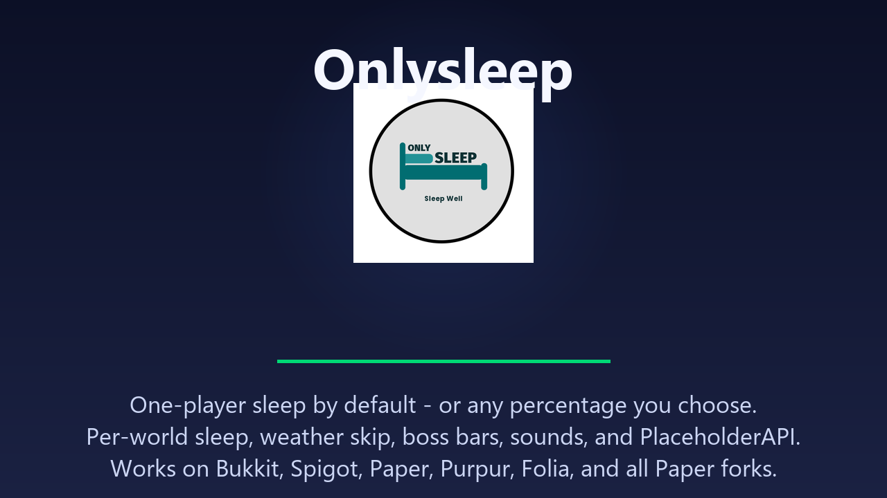

# Onlysleep



**One player sleeps. Everyone wakes up.**

No complicated setup. No wall of config. Drop the JAR in, restart, and players can actually skip the night for once.

---

## Features

- One-player sleep by default, or any percentage you want
- Per-world sleep (each world tracks separately)
- Weather skip: clear rain and thunder independently
- Boss bar, action bar, progress bar, and title support
- Sounds when someone starts sleeping and when night is skipped
- AFK detection (built-in, plus EssentialsX and CMI)
- Filters out spectators, creative, flying, and exempt players
- Automatic gamerule management for `playersSleepingPercentage`
- PlaceholderAPI: 12+ placeholders
- Update checker and bStats (opt-out available)

## Installation

1. Download the JAR.
2. Drop it into your `plugins/` folder.
3. Restart your server.
4. Edit `plugins/Onlysleep/config.yml` if you want to tweak anything.
5. Apply changes with `/onlysleep reload`.

**Requirements:** Java 21+, Minecraft 1.16.5+. Works on its own. PlaceholderAPI is optional.

## Commands

| Command | Description | Permission |
|---------|-------------|------------|
| `/onlysleep` | Show help | `onlysleep.command` |
| `/onlysleep reload` | Reload config | `onlysleep.reload` |
| `/onlysleep info` | Plugin info | `onlysleep.info` |
| `/onlysleep status` | Status overview | `onlysleep.status` |

**Aliases:** `/os`, `/sleep`

## Permissions

| Permission | Default | Description |
|------------|---------|-------------|
| `onlysleep.*` | OP | All permissions |
| `onlysleep.command` | Everyone | Use commands |
| `onlysleep.info` | OP | View plugin info |
| `onlysleep.reload` | OP | Reload config |
| `onlysleep.status` | OP | View status |
| `onlysleep.exempt` | None | Excluded from sleep (operators sleep by default) |
| `onlysleep.update` | OP | Update alerts |

## Configuration

Defaults work fine. The main knob is `sleep-percentage` in `config.yml`:

- `0` = one player sleeps, everyone wakes up
- `50` = half the server needs to be in bed
- `100` = everyone has to sleep

Set `per-world-sleep: false` if you want global counting across all worlds.

See [`config.yml`](src/main/resources/config.yml) for every option and [`messages.yml`](src/main/resources/messages.yml) for message customization.

## PlaceholderAPI

If you have [PlaceholderAPI](https://placeholderapi.com/) installed, these placeholders are available:

| Placeholder | Description |
|-------------|-------------|
| `%onlysleep_sleeping%` | Sleeping players in the player's world |
| `%onlysleep_required%` | Players needed to skip the night |
| `%onlysleep_percentage%` | Configured sleep percentage |
| `%onlysleep_total%` | Total eligible players in the world |
| `%onlysleep_progress%` | % of required sleepers achieved (0-100) |
| `%onlysleep_progress_bar%` | Visual progress bar |
| `%onlysleep_sleeping_names%` | Comma-separated names of sleeping players |
| `%onlysleep_status%` | "Sleeping" or "Awake" |
| `%onlysleep_is_sleeping%` | `true`/`false` |
| `%onlysleep_is_night%` | `true`/`false` if it's night |
| `%onlysleep_is_sleepable%` | `true`/`false` if night/storm |
| `%onlysleep_skipping%` | `true`/`false` if a skip is scheduled |
| `%onlysleep_enabled%` | `true`/`false` if sleeping is enabled in the world |
| `%onlysleep_afk%` | `true`/`false` if the player is AFK |
| `%onlysleep_version%` | Plugin version |
| `%onlysleep_platform%` | Server platform (Folia/Paper/Spigot/Bukkit) |
| `%onlysleep_world_sleeping_<world>%` | Sleeping count in a specific world |
| `%onlysleep_world_required_<world>%` | Required count in a specific world |
| `%onlysleep_world_total_<world>%` | Total eligible in a specific world |

## Building

```bash
git clone https://github.com/DemonZ-Development/Onlysleep.git
cd Onlysleep
./gradlew clean build
```

The compiled JAR is in `build/libs/`.

## bStats

[](https://bstats.org/plugin/bukkit/OnlySleep/31415)

Anonymous stats only. No personal data. Opt out in `plugins/bStats/config.yml`.

## Links

- [Website](https://demonzdevelopment.online)
- [GitHub](https://github.com/DemonZ-Development/Onlysleep)
- [Discord](https://discord.gg/qkvkEaPryF)
- [Twitter / X](https://x.com/DemonZ_Dev)
- [YouTube](https://www.youtube.com/@DemonzDevelopment)
- [demonzdevelopment@gmail.com](mailto:demonzdevelopment@gmail.com)

---

## Sponsored By

<div align="center">
  <a href="https://nexeu.zip">
    
  </a>
  <br>
  Looking for high-performance, budget-friendly game server hosting? Check out <a href="https://nexeu.zip"><b>Nexeu Hosting</b></a>!
</div>
