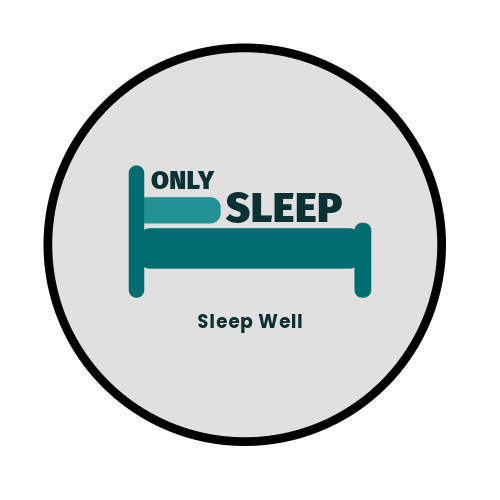

# Onlysleep

**One player sleeps. Everyone wakes up.**

**Supports:** Bukkit, Spigot, Paper, Purpur, Folia, and any Paper fork
**Minecraft:** 1.20.4–26.2 · **Java:** 21+ (Paper 26.1+ requires Java 25)

---

A lightweight sleep plugin that does one thing well: skip the night when a player goes to bed. No bloat, no wall of config you'll never touch. Just drop it in, and it works.

## Features

- One-player sleep by default, or any percentage (0-100%)
- Per-world sleep (each world tracks separately)
- Weather skip: clear rain and thunder independently
- Boss bar, action bar, progress bar, and title support
- Sounds when someone starts sleeping and when night is skipped
- AFK detection (built-in, plus EssentialsX and CMI)
- Filters out spectators, creative, flying, and exempt players
- Automatic gamerule management for `playersSleepingPercentage`
- PlaceholderAPI: 12+ placeholders
- Update checker and bStats (opt-out available)
- Full Folia support with regionized scheduler

## Quick Start

1. Download the latest `Onlysleep-*.jar` from [Modrinth](https://modrinth.com/plugin/onlysleep), [Hangar](https://hangar.papermc.io/DemonzDevelopment/Onlysleep), or [GitHub Releases](https://github.com/DemonZ-Development/Onlysleep/releases).
2. Drop it into your server's `plugins/` folder.
3. Restart your server.
4. Edit `plugins/Onlysleep/config.yml` if you want to tweak anything.
5. Apply changes with `/onlysleep reload`.

> No dependencies required. PlaceholderAPI is optional.

## Basic Commands

| Command | Description |
|---------|-------------|
| `/onlysleep help` | Show help page |
| `/onlysleep info` | Show plugin information |
| `/onlysleep status` | Detailed status (requires `onlysleep.status`) |
| `/onlysleep reload` | Reload configuration (requires `onlysleep.reload`) |

**Aliases:** `/os`, `/sleep`

## Wiki Pages

- [Installation](Installation)
- [Configuration](Configuration)
- [Messages](Messages)
- [Commands & Permissions](Commands-and-Permissions)
- [Placeholders](Placeholders)
- [Developer API](Developer-API)
- [FAQ & Troubleshooting](FAQ)
- [Building from Source](Building)
- [Changelog](Changelog)

## bStats

This plugin uses [bStats](https://bstats.org/plugin/bukkit/OnlySleep/31415) to collect anonymous usage statistics. No personal data is collected. You can opt out in `plugins/bStats/config.yml`.

## Support

- [GitHub Issues](https://github.com/DemonZ-Development/Onlysleep/issues)
- [Discord](https://discord.gg/qkvkEaPryF)

---

## Sponsored By

  
   
  Looking for high-performance, budget-friendly game server hosting? Check out <a href="https://nexeu.zip"><b>Nexeu Hosting</b></a>!

---

Licensed under the [MIT License](https://github.com/DemonZ-Development/Onlysleep/blob/master/LICENSE).
